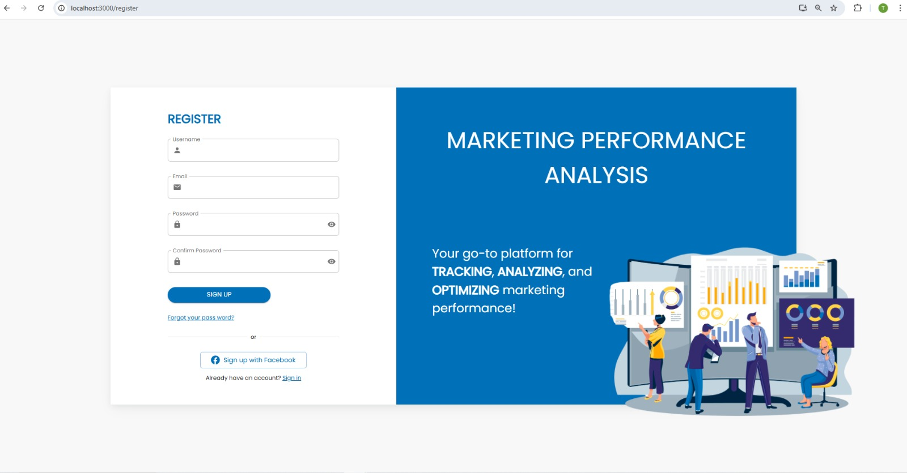
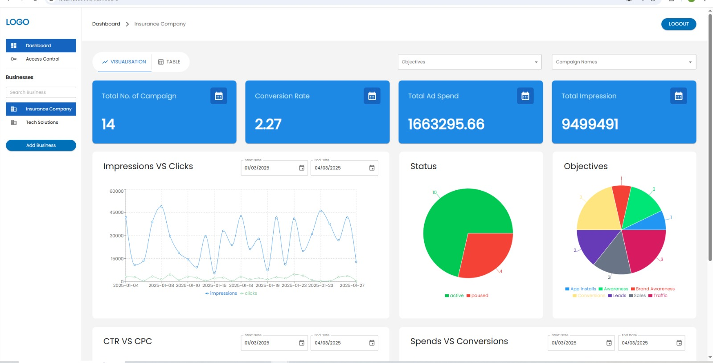
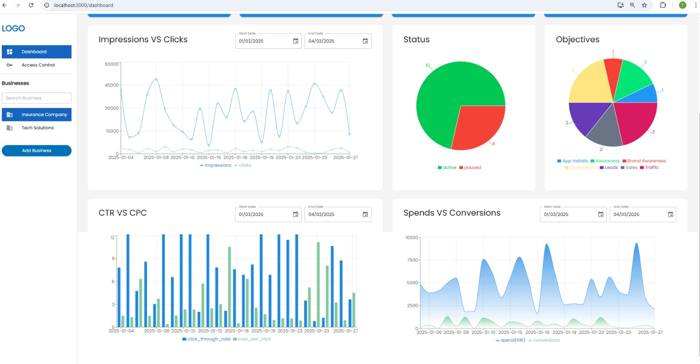
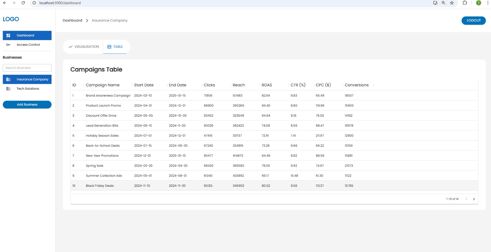

# Marketing-Performance-Analysis📝

Marketing-Performance-Analysis is a responsive and interactive marketing performance analysis dashboard built with ReactJS, Material-UI, and Chart.js. It empowers businesses to visualize and understand their ad campaign data through dynamic charts, detailed tables, and intelligent filters.

## Features🎯

- **Dynamic Data Visualizations**: Leverage Chart.js for interactive line, bar, and pie charts showcasing key marketing metrics.
- **User Authentication**: Secure login and registration system to protect access and personalize user experience.
- **KPI Insights**: Monitor essential marketing KPIs such as CTR (Click-Through Rate), CPC (Cost Per Click), and ROI (Return on Investment).
- **Date-wise Statistics**: Analyze campaign performance over specific time ranges using intuitive date filters.
- **Campaign Filtering**: Filter and segment data by individual campaigns to get focused insights.
- **Responsive UI**: Built using Material-UI, ensuring a seamless experience across devices.
- **Interactive Tables**: View, sort, and explore campaign metrics through user-friendly data tables.

## Technologies💻

-**Frontend:**

- [ReactJs](https://react.dev/learn) - Enhances blog interactivity and responsiveness with its efficient UI rendering capabilities.

- [Material-UI](https://mui.com/material-ui/getting-started/) - Provides a sleek and consistent design for blog components, ensuring a polished user interface.

-**Backend:**

- [Node.js](https://nodejs.org/en) - Powers the backend of the blog platform, handling requests and enabling server-side logic.
- [Express](https://recoiljs.org/docs/introduction/getting-started) - Facilitates routing and middleware integration, supporting smooth API interactions and backend operations.
- [Mongoose](https://mongoosejs.com/) - Facilitates seamless interaction with MongoDB, providing schema-based modeling for blog data.

-**Database:**

- [MongoDB](https://www.mongodb.com/cloud/atlas/register) - Stores blog data in a flexible and scalable document-oriented database, ensuring efficient data management.

-**Authentication:**

- [Appwrite](https://appwrite.io/) - Enables secure user authentication for the blog platform.

## Login

## SignUp

## Analytics Dashboard (1)

## Analytics Dashboard (2)

## Campaign Table

